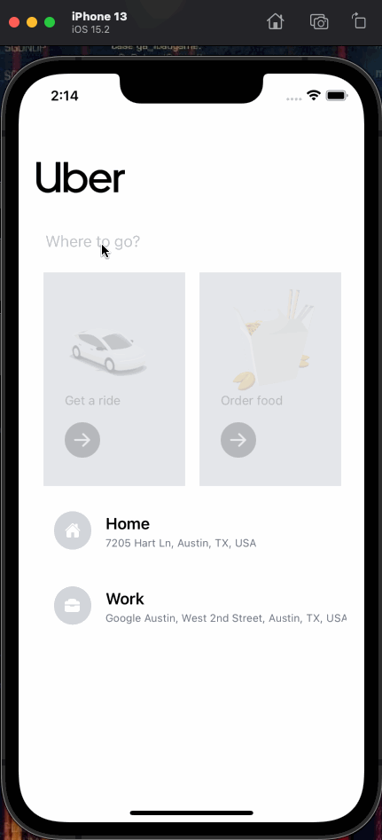

# Uber-Clone

Type: Mobile application

Build with React Native

### Dependencies:
- [Redux Toolkit](https://redux-toolkit.js.org/)
- [React-Redux](https://react-redux.js.org/)
- [Tailwind](https://tailwindcss.com/)
    - [Tailwind React Native Classnames](https://github.com/jaredh159/tailwind-react-native-classnames)
- [Google APIs](https://cloud.google.com/)
    - Places API
    - Distance Matrix API
    - Directions API
- [React-native-google-places-autocomplete](https://github.com/FaridSafi/react-native-google-places-autocomplete)

### Screenshots

